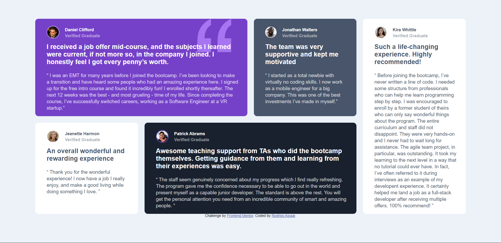

# Frontend Mentor - Testimonials grid section solution

This is a solution to the [Testimonials grid section challenge on Frontend Mentor](https://www.frontendmentor.io/challenges/testimonials-grid-section-Nnw6J7Un7). Frontend Mentor challenges help you improve your coding skills by building realistic projects.

### The challenge

Users should be able to:

- View the optimal layout for the site depending on their device's screen size

### Screenshot

### Built with

- Semantic HTML5 markup
- CSS custom properties
- CSS Grid
- Mobile-first workflow

### What I learned

I was able to wrap my mind around the CSS grid layout concepts.

### Useful resources

- [MDN Web Docs](https://developer.mozilla.org/) - MDN Web Docs is just amazing for documentation, I could find everything I needed there.
- [W3 Schools](https://www.w3schools.com/) - They let you test and play around with a lot of stuff before you implement it in your code.

## Author

- Website - [Add your name here](https://www.your-site.com)
- Frontend Mentor - [@yourusername](https://www.frontendmentor.io/profile/yourusername)
- Twitter - [@_RodrigoAguiar_](https://twitter.com/_RodrigoAguiar_)
